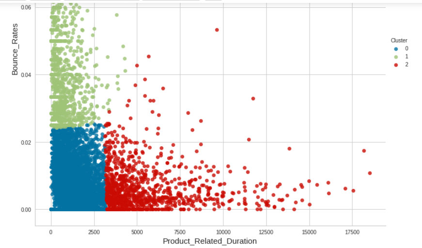

# Online_Shoppers_Intention

# Problem Statement

Based on given data of visitors browsing for online shopping, build different clusters to know whether a person is only browsing and visiting multiples pages or also interested in buying the products as well.

# Attribute Information:
The dataset consists of feature vectors belonging to 12,330 sessions. The dataset was formed so that each session would belong to a different user in a 1-year period to avoid any tendency to a specific campaign, special day, user profile, or period. The dataset consists of 10 numerical and 8 categorical attributes.

"Administrative", "Administrative Duration", "Informational", "Informational Duration", "Product Related" and "Product Related Duration" represent the number of different types of pages visited by the visitor in that session and total time spent in each of these page categories.
The values of these features are derived from the URL information of the pages visited by the user and updated in real time when a user takes an action, e.g. moving from one page to another. 

The "Bounce Rate", "Exit Rate" and "Page Value" features represent the metrics measured by "Google Analytics" for each page in the e-commerce site. 
The value of "Bounce Rate" feature for a web page refers to the percentage of visitors who enter the site from that page and then leave ("bounce") without triggering any other requests to the analytics server during that session. 
The value of "Exit Rate" feature for a specific web page is calculated as for all pageviews to the page, the percentage that were the last in the session. 
The "Page Value" feature represents the average value for a web page that a user visited before completing an e-commerce transaction. 
The "Special Day" feature indicates the closeness of the site visiting time to a specific special day (e.g. Mother’s Day, Valentine's Day) in which the sessions are more likely to be finalized with transaction. The value of this attribute is determined by considering the dynamics of e-commerce such as the duration between the order date and delivery date. 

# Methodology

The following techniques have been used to group the customers:-
1. K-Means Clustering
2. Principal Component Analysis (PCA) for Dimensionality Reduction

The optimal number of clusters was found to be 3 based on the scree plot and later validated by the silhouette score.

The following graph summarizes the clusters formed with respect to Product Related Duration and Bounce Rates as the two important variables 

